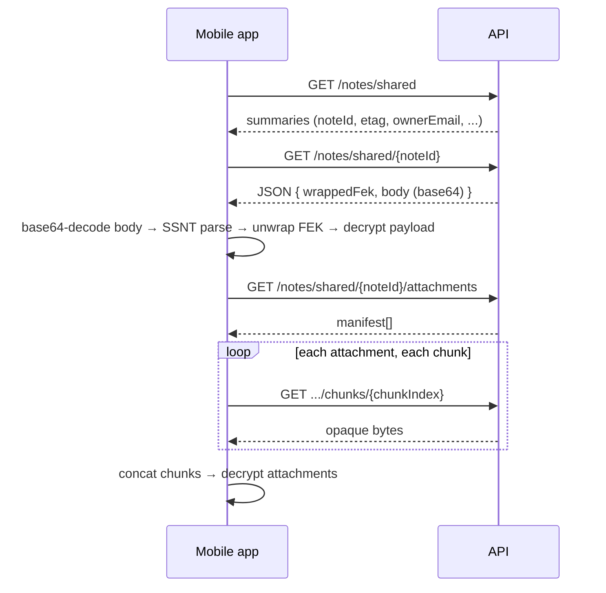

# Shared notes API — mobile client guide

How note sharing works end-to-end: what to send, what you get back, and how to assemble a shared note locally.

Base URL: `/v1`  
Auth: `Authorization: Bearer <accessToken>` on every route below.

---

## Overview

Sharing is **read-only for the recipient**. The server stores:

1. A **share grant** (`note_shares` row): `noteId`, owner, recipient, and a per-recipient `wrappedFek` (FEK encrypted for the recipient's identity public key).
2. The **owner's note body** (opaque SSNT bytes) and **attachments** (opaque chunked bytes) — unchanged; the recipient reads them through shared routes.

The server never decrypts anything. The mobile client must:

1. Unwrap `wrappedFek` with the recipient's identity private key.
2. Parse the note **body** as SSNT and decrypt `encrypted_payload` with the FEK.
3. Download attachments separately and decrypt them with the same FEK.

Attachments are **not** embedded in the body blob. Do not expect a single monolithic note file from the API.

---

## Wire formats (magic bytes)

There is **no `SSNF` format** in this API. If your parser reports `expected SSNF` (or similar), check that you are using the correct magic:

| Format | Magic (4 ASCII bytes) | Used for |
|--------|----------------------|----------|
| **SSNV** | `53 53 4E 56` (`"SSNV"`) | Vault header (`GET/PUT /vault/header`) |
| **SSNT** | `53 53 4E 54` (`"SSNT"`) | Note body (owner and shared download) |

Note bodies always start with **`SSNT`**, then version byte `1`.

### SSNT v1 layout (body blob)

After the magic, fields are big-endian unless noted:

| Offset (conceptual) | Field | Size | Notes |
|---------------------|-------|------|-------|
| 0 | magic | 4 | `"SSNT"` |
| 4 | version | 1 | Must be `1` |
| 5 | note_id | 16 | UUID raw bytes |
| 21 | title | u32 length + UTF-8 | Plaintext title (indexed server-side) |
| | created_at | 8 | UInt64 BE, Unix seconds |
| | updated_at | 8 | UInt64 BE, Unix seconds |
| | attachment_count | 4 | UInt32 BE — must match manifest |
| | attachments_total_size | 8 | UInt64 BE — must match manifest |
| | wrapped_fek | u32 length + bytes | Opaque; owner unwraps locally |
| | encrypted_payload | u32 length + bytes | Opaque; decrypt with FEK |
| end | — | — | **No trailing bytes** after `encrypted_payload` |

Length-prefixed fields: `uint32_be(length)` then `length` bytes.

---

## Roles and routes

### Owner (shares a note)

#### 1. Look up recipient public key

```
GET /v1/users/public-key?email={recipientEmail}
```

**Response `200`:**
```json
{
  "publicKey": "<base64, 32 bytes>",
  "algorithmId": 1
}
```

`algorithmId: 1` = Curve25519 (X25519). Recipient must have uploaded a vault header (`PUT /vault/header`) or this returns `404 public_key_not_found`.

#### 2. Create share grant

Client-side: wrap the note's FEK with the recipient's public key → `wrappedFek` bytes.

```
POST /v1/notes/{noteId}/share
Content-Type: application/json
```

**Request:**
```json
{
  "recipientEmail": "bob@example.com",
  "wrappedFek": "<standard base64, no newlines>"
}
```

**Response `201`:**
```json
{
  "shareId": "770e8400-e29b-41d4-a716-446655440003",
  "recipientEmail": "bob@example.com",
  "sharedAt": "2026-08-03T10:00:00.000Z"
}
```

**Errors:** `404 note_not_found`, `404 user_not_found`, `400 validation_error` (self-share, invalid base64), `409 already_shared`.

#### 3. Revoke share (owner)

```
DELETE /v1/notes/{noteId}/share/{recipientEmail}
```

**Response:** `204 No Content`

---

### Recipient (reads a shared note)

#### 1. List shared notes

```
GET /v1/notes/shared
```

**Response `200`:**
```json
[
  {
    "noteId": "550e8400-e29b-41d4-a716-446655440001",
    "title": "Shared note",
    "updatedAt": 1700000000,
    "etag": "a1b2c3...",
    "ownerEmail": "alice@example.com",
    "ownerId": "550e8400-e29b-41d4-a716-446655440000",
    "sharedAt": "2026-08-03T10:00:00.000Z"
  }
]
```

- `updatedAt` / `etag` reflect the **owner's** note (use for "note was updated" UI and sync).
- `updatedAt` is **Unix seconds** (integer), not ISO-8601.

#### 2. Download body + wrapped FEK (JSON — recommended for first open)

```
GET /v1/notes/shared/{noteId}
```

**Response `200` (`Content-Type: application/json`):**
```json
{
  "noteId": "550e8400-e29b-41d4-a716-446655440001",
  "wrappedFek": "<base64>",
  "body": "<base64-encoded SSNT bytes>"
}
```

**Client steps:**

1. Parse JSON.
2. `let wrappedFekData = Data(base64Encoded: json.wrappedFek)`
3. `let bodyData = Data(base64Encoded: json.body)` ← **required**
4. Verify `bodyData` starts with bytes `SSNT` (not JSON `{`, not attachment bytes).
5. Parse SSNT from `bodyData`; unwrap FEK from `wrappedFekData`; decrypt payload.

**Breaking change:** field is **`body`**, not **`blob`**. Older clients that read `blob` will fail or get `nil`.

#### 3. Download body only (raw bytes — alternative)

```
GET /v1/notes/shared/{noteId}/body
```

**Response `200`:**
- Body: **raw SSNT bytes** (`Content-Type: application/octet-stream`)
- Header: `ETag: "<sha256-hex-of-body-bytes>"` (body etag only, not composite note etag)

Use this when you already have `wrappedFek` from a previous JSON download or local cache. Response is **not** JSON — do not run a JSON decoder on it.

You still need `wrappedFek` from the share grant. It is only returned in:

- `GET /v1/notes/shared/{noteId}` (JSON), or
- your local DB after the first successful download.

#### 4. List attachments (manifest only)

```
GET /v1/notes/shared/{noteId}/attachments
```

Same shape as owner manifest:

```json
[
  {
    "attachmentId": "660e8400-e29b-41d4-a716-446655440010",
    "sizeBytes": 2048,
    "etag": "d4e5f6...",
    "updatedAt": 1700000100,
    "contentType": "image/jpeg",
    "totalChunks": 1,
    "chunkSize": 5242880
  }
]
```

#### 5. Download attachment chunks

For each `chunkIndex` from `0` to `totalChunks - 1`:

```
GET /v1/notes/shared/{noteId}/attachments/{attachmentId}/chunks/{chunkIndex}
```

**Response `200`:**
- Body: opaque encrypted bytes (`application/octet-stream`)
- Header: `ETag: "<attachment_etag>"` (same for every chunk)
- Last chunk may be smaller than `chunkSize` (5_242_880 bytes)

Concatenate chunks in order → verify SHA-256 matches manifest `etag` → decrypt with FEK.

**There is no** `GET .../attachments/{attachmentId}` full-file route. Only chunked download.

#### 6. Remove from my shared list (recipient)

```
DELETE /v1/notes/shared/{noteId}
```

**Response:** `204 No Content` — deletes the share grant for this user only; does not delete the owner's note.

---

## End-to-end recipient flow



---

## Common mistakes (magic / parse errors)

### `Invalid magic: expected b'SSNT', got ...`

The bytes you passed to the SSNT parser are **not** a note body.

| Mistake | What you actually have | Fix |
|---------|------------------------|-----|
| Parse HTTP body of `GET /notes/shared/{id}` as SSNT | JSON text starting with `{` | Parse JSON first; base64-decode the `body` field |
| Use `wrappedFek` string/bytes as SSNT | Base64 or ciphertext | Only use the `body` field (or `/body` raw response) for SSNT |
| Read old `blob` field | `nil` or wrong data | Use `body` (API v1.1+) |
| Use attachment chunk bytes as note body | Encrypted attachment data | Download `/body` or JSON `body`; attachments are separate |
| Skip base64 decode | ASCII base64 string | `Data(base64Encoded:)` on `body` before parse |
| Wrong endpoint | Error JSON `{"error":"share_not_found",...}` | Check status code and `error` field |

If the error shows something like `got b'1'` or unexpected short ASCII, you are often **off by one or more bytes** (e.g. reading version byte `1` as magic, or slicing into the middle of the blob).

### `expected SSNF` (client-side typo)

The server and formats use **`SSNT`** (note) and **`SSNV`** (vault). Rename your client parser constant if it says `SSNF`.

### Treating shared note like monolithic owner blob

Legacy flow downloaded one blob containing body + inline attachments. Current API:

- Body: `GET /notes/shared/{noteId}` → `body` or `GET .../body`
- Attachments: lazy chunk GETs under `/notes/shared/{noteId}/attachments/...`

`attachment_count` / `attachments_total_size` in the SSNT header describe attachments on the server; fetch them via the manifest + chunk routes.

---

## Request / response checklist

| Action | Method | Path | Request body | Response |
|--------|--------|------|--------------|----------|
| List shared | GET | `/notes/shared` | — | JSON array |
| Download note | GET | `/notes/shared/{noteId}` | — | JSON `{ noteId, wrappedFek, body }` |
| Download body raw | GET | `/notes/shared/{noteId}/body` | — | Raw SSNT bytes + `ETag` |
| List attachments | GET | `/notes/shared/{noteId}/attachments` | — | JSON array |
| Attachment chunk | GET | `/notes/shared/{noteId}/attachments/{id}/chunks/{i}` | — | Raw bytes + `ETag` |
| Remove share (recipient) | DELETE | `/notes/shared/{noteId}` | — | `204` |
| Share (owner) | POST | `/notes/{noteId}/share` | JSON `{ recipientEmail, wrappedFek }` | `201` + share metadata |
| Revoke (owner) | DELETE | `/notes/{noteId}/share/{email}` | — | `204` |
| Public key lookup | GET | `/users/public-key?email=` | — | JSON `{ publicKey, algorithmId }` |

Shared routes are **read-only**: no `PUT`/`POST`/`DELETE` on shared attachment paths.

---

## Error codes (sharing)

| HTTP | `error` | When |
|------|---------|------|
| 401 | `unauthorized` | Missing/invalid token |
| 404 | `share_not_found` | No grant, or shared body missing |
| 404 | `user_not_found` | Unknown email (share create / public key) |
| 404 | `attachment_not_found` | Bad attachment or chunk index |
| 400 | `validation_error` | Bad `wrappedFek`, self-share, invalid chunk index |
| 409 | `already_shared` | Duplicate share |

Full catalog: [api-errors.md](api-errors.md).

---

## Minimal Swift-shaped pseudocode

```swift
// 1. Download
let download: SharedNoteDownload = try await api.get("/v1/notes/shared/\(noteId)")

// 2. Decode — do NOT pass download JSON bytes to SSNTParser
guard let bodyData = Data(base64Encoded: download.body),
      let wrappedFek = Data(base64Encoded: download.wrappedFek) else {
    throw ShareError.invalidBase64
}
precondition(bodyData.starts(with: "SSNT".data(using: .utf8)!))

// 3. Parse & decrypt
let ssnt = try SSNTParser.parse(bodyData)
let fek = try crypto.unwrapFEK(wrappedFek, identityPrivateKey: myKey)
let plaintext = try crypto.decrypt(ssnt.encryptedPayload, fek: fek)

// 4. Attachments (if ssnt.attachmentCount > 0)
let manifest = try await api.get("/v1/notes/shared/\(noteId)/attachments")
for item in manifest {
    var blob = Data()
    for index in 0..<item.totalChunks {
        let chunk = try await api.getRaw(
            "/v1/notes/shared/\(noteId)/attachments/\(item.attachmentId)/chunks/\(index)"
        )
        blob.append(chunk)
    }
    try verifySHA256(blob, expected: item.etag)
    let file = try crypto.decryptAttachment(blob, fek: fek)
}
```

---

## Related docs

- [api.md](api.md) — full REST reference
- [mobile-sync-guide.md](mobile-sync-guide.md) — attachment chunk download
- [SPEC.md](SPEC.md) — breaking changes (`blob` → `body`)
- [api-errors.md](api-errors.md) — error messages and patterns
